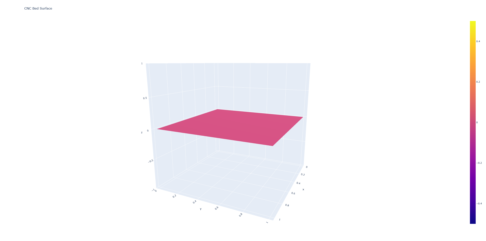

# CNC Bed Surface Plot

A simple Python tool that shows your CNC machine bed as a 3D surface. Helps you see where you need to add shims to flatten the bed.



## Features

- Creates 3D plots from your bed measurements
- Interactive plots you can rotate and zoom

## Installation

Clone the repository:

```bash
git clone https://github.com/sondresjolyst/cnc-surface-plot.git
cd cnc-surface-plot
```

Install dependencies:

```bash
uv sync
```

## Usage

## Taking Measurements

Use a dial indicator or probe to measure height differences from a reference point.
Positive Z = above reference, Negative Z = below reference.

## Quick Example

Here's a typical measurement set for a warped bed:

```python
points = [
    {"x": 5, "y": 5, "z": 0},      # Center (reference point)
    {"x": 1, "y": 1, "z": -0.2},   # Bottom-left low
    {"x": 10, "y": 1, "z": 0.1},   # Bottom-right high
    {"x": 1, "y": 10, "z": 0.05},  # Top-left slightly high  
    {"x": 10, "y": 10, "z": -0.1}, # Top-right low
]
```

1. **Add your measurements** to the `points` list in `main.py`:

```python
points = [
    # Center Section
    {"x": 5, "y": 5, "z": 0.1},    # Center point with your Z measurement
    
    # Corner measurements (units in mm/inches - adjust range to match your bed size)
    {"x": 1, "y": 1, "z": 0.0},    # Bottom-left corner
    {"x": 10, "y": 1, "z": -0.05}, # Bottom-right corner
    {"x": 1, "y": 10, "z": 0.02},  # Top-left corner
    {"x": 10, "y": 10, "z": 0.03}, # Top-right corner
]
```

2. **Run the tool**:

```bash
python main.py
```

3. **View the plot** in your browser

## Adding More Points

The points are organized by bed sections:

- **Center Section**: The middle of your bed
- **Corner Sections**: Points from each corner toward the center

Add more points by uncommenting examples or adding new ones:

```python
# Top-Left to Center
{"x": 1, "y": 10, "z": 0},     # Top-left corner
{"x": 3, "y": 8, "z": 0.01},   # Point along diagonal
```

## What the Plot Shows

The 3D surface shows:

- **Flat areas**: Your bed is level
- **Dips or bumps**: Problem areas that need fixing

## Settings

Change the surface smoothness:

```python
grid_resolution = 50  # Higher = smoother
```

## License

MIT License - see [LICENSE](LICENSE) file.
